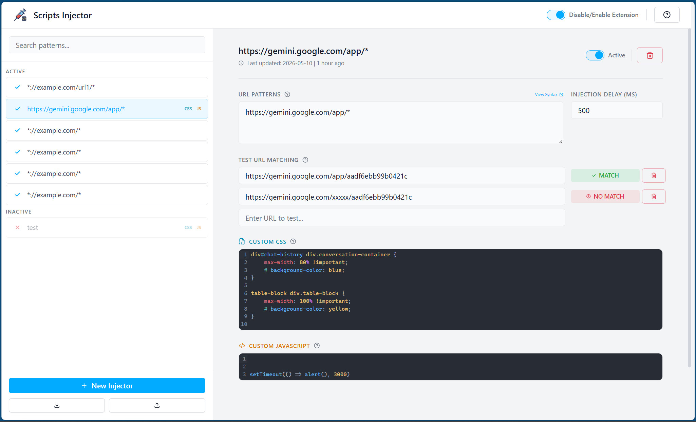

# Scripts Injector

Scripts Injector is a high-performance, Manifest V3 Chrome extension engineered to inject custom JavaScript and CSS payloads into targeted web pages based on sophisticated URL glob patterns. Operating at the browser's background service worker level, the mechanism bypasses isolated extension environments, executing scripts directly within the target site's `MAIN` execution world while seamlessly handling Trusted Types enforcement. Designed for both developers and power users, it provides a robust platform for real-time web modification and scripting orchestration.

## Core Dependencies
- **Vite & React**: Chosen for their rapid development cycle and component-driven architecture, enabling a highly responsive and maintainable Options UI (`src/options`).
- **Tailwind CSS & Radix UI**: Utilized for their utility-first styling and accessible, unstyled primitives (like Dialogs and Switches), ensuring a professional, glass-morphic, and highly readable configuration interface.
- **CodeMirror 6**: Integrated specifically for its lightweight, extensible, and performant code editing capabilities, providing syntax highlighting and editing for raw CSS and JavaScript payloads.
- **TypeScript**: Mandated across the entire codebase to provide rigorous type safety, ensuring reliable configuration schemas and predictable Chrome API interactions.

---

## Logic Flow & Data Pipeline
1. **Navigation Event Trigger**: The process initiates when Chrome dispatches a `chrome.tabs.onUpdated` or `chrome.tabs.onActivated` event. The background service worker (`service-worker.ts`) captures the target `tabId` and `url`.
2. **State Retrieval & Validation**: The `orchestrateInjection` function fetches the global configuration from `chrome.storage.local` via `getAll()`. If the `globalEnabled` flag is false, execution halts, and the badge is updated to "OFF".
3. **Pattern Matching**: For each stored script configuration, the target URL is evaluated against the script's `urlPatterns` using `matchesUrlOptimized`. A regex cache maps glob strings to compiled `RegExp` objects to prevent redundant compilation overhead during rapid navigations.
4. **Injection Execution**:
   - **CSS Pipeline**: If a match occurs and `cssCode` exists, `chrome.scripting.insertCSS` is invoked to apply styles directly to the `tabId`.
   - **JavaScript Pipeline**: If `jsCode` exists, `chrome.scripting.executeScript` is called. Critically, the `world` is explicitly set to `MAIN`, escaping the isolated extension context.
5. **Trusted Types & DOM Injection**: Within the target's `MAIN` context, the injected function evaluates `(window as any).trustedTypes`. If an active Content Security Policy (CSP) enforces Trusted Types, a dynamic policy is instantiated to sanitize the payload. The code is then encapsulated in a `<script>` element, appended to the DOM for immediate evaluation, and subsequently removed to maintain DOM hygiene.
6. **Badge Indication**: The extension icon badge is dynamically updated to reflect the total count of active, successfully matched scripts on the current page.

---

## Technical Architecture
The extension relies on a modular, asynchronous, and event-driven architecture built on TypeScript and Chrome's Manifest V3.

### Core Modules
- **`src/background/service-worker.ts`**: The central orchestrator. Listens to browser navigation events, evaluates regex patterns, and dispatches the execution of CSS and JavaScript payloads into target tabs.
- **`src/options/App.tsx`**: The primary user interface. Manages state synchronization between React components and Chrome's local storage, handling script creation, editing, and global enable/disable toggles.
- **`src/lib/storage.ts`**: The data persistence layer. Provides typed, asynchronous wrappers around the `chrome.storage` API for setting and retrieving the `ScriptEntry` configurations.
- **`src/lib/url-matcher.ts`**: The pattern compilation engine. Converts user-defined glob strings (e.g., `*://*.google.com/*`) into standard JavaScript `RegExp` patterns for evaluation against active URLs.
- **`src/components/CodeEditor.tsx`**: The CodeMirror integration wrapper. Provides an isolated React component for safe, stateful code manipulation with proper language extensions.

---

## Advanced Logic: Context-Aware Script Injection Engine
The most complex and critical component of the system lies within the `inject` function inside `service-worker.ts`. Chrome extensions inherently execute scripts in an "ISOLATED" world, meaning they cannot interact with the global JavaScript objects (like `window` variables or frameworks) defined by the host website.

To circumvent this limitation and provide maximum utility, the engine forces execution into the `MAIN` world via `chrome.scripting.executeScript`. However, modern web applications often implement rigorous Content Security Policies, specifically `Trusted Types`, which aggressively block raw string evaluation in DOM injection methods to prevent XSS. 

The injection engine mitigates this by dynamically querying the `MAIN` world for `window.trustedTypes`. If detected, it synthesizes a unique, randomized Trusted Type policy (`kw-injector-[hash]`) on the fly. This policy acts as a cryptographic handshake, returning a trusted script object that the host's CSP will accept. The payload is then injected via a dynamically created `<script>` element and executed. This entire operation, including an optional developer-defined execution delay (`delayMs`), runs asynchronously within the target page's thread, ensuring reliable code execution regardless of the target site's security posture.

---

## Development Setup

### Environment Requirements
- OS: Windows, macOS, or Linux
- Node.js: v18.0.0 or higher
- Package Manager: `npm` (v9+)

### Installation
```powershell
# Clone the repository
git clone https://github.com/krittanon-w/kw-browser-extension-scripts-injector.git
cd kw-browser-extensions

# Install project dependencies
npm install
```

### Configuration
Configuration and payload data are entirely serialized and stored within the browser's `chrome.storage.local`. The type schema for these configurations is defined in `src/lib/types.ts`.
- **Key: `kw_scripts`**: An array of `ScriptEntry` objects containing `id`, `name`, `urlPatterns`, `cssCode`, `jsCode`, `enabled`, and `delayMs`.
- **Key: `kw_global_enabled`**: A boolean dictating the master kill-switch state for the extension.

---

## Running Locally
1. Execute the development build script: `npm run build` or `npm run dev`.
2. Open Google Chrome and navigate to `chrome://extensions/`.
3. Enable **Developer mode** in the top right corner.
4. Click **Load unpacked**.
5. Select the `dist/` folder generated in your project directory.
6. The extension will appear in your toolbar. Click it to open the Options page and begin configuring payloads.

---

## Building the Executable
The extension is bundled using Vite and TypeScript.

```powershell
# Clean build and compile
npm run build
```
This script triggers `tsc -b` for strict type checking, followed by `vite build`. The Vite configuration (`vite.config.ts`) processes React components, resolves Tailwind CSS directives, and bundles the service worker and options UI into a highly optimized, minified `dist` directory. The resulting `dist` folder is the deployable artifact ready for compression into a `.zip` file for Chrome Web Store submission.

---

## Testing

### Running Logic Tests
Unit testing is handled by ESLint to enforce code quality and type logic.
```powershell
# Run the linter
npm run lint
```
The linter validates all TypeScript and React files against standard conventions and React Hooks rules. 

---

## Troubleshooting
- **Scripts Failing to Execute on Certain Sites**: 
  - *Cause*: High-security sites may completely block inline scripts via an immutable CSP that disables `unsafe-inline`, bypassing even Trusted Types bypasses.
  - *Solution*: Check the browser console on the target site for CSP violation errors.
- **Code Editor Not Saving Changes**:
  - *Cause*: React state synchronization issues during rapid typing.
  - *Solution*: Ensure you click off the code editor or rely on the `onBlur`/`onChange` handlers to flush state to `chrome.storage`. Verify the `dist/` folder is actively being rebuilt if in development.
- **URL Pattern Not Matching**:
  - *Cause*: Incorrect glob syntax.
  - *Solution*: Remember that `*` matches any character. For a whole domain, use `*://*.example.com/*` rather than `example.com`.
