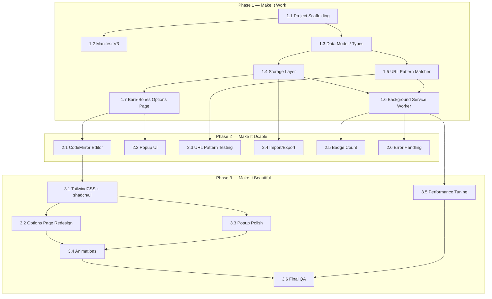

# Development Plan: CSS & JS Injector — Chrome Extension

> **Philosophy:** Functionality-First Development
> 1. Make it work first
> 2. Then make it usable
> 3. Then make it beautiful

**PRD Reference:** [prd-css-js-injector.md](file:///d:/developments/kw-browser-extensions/tasks/prd-css-js-injector.md)

---

## Phase 1 — Make It Work 🔧

> **Goal:** Core injection engine works end-to-end. A script can be created, stored, and injected into a matching page. UI is ugly or minimal — that's fine.

### 1.1 Project Scaffolding & Build Pipeline

| Item | Detail |
|---|---|
| **Task** | Initialize the project with Vite, TypeScript strict mode, and Chrome extension build output |
| **User Stories** | — (infrastructure) |
| **Deliverables** | `package.json`, `tsconfig.json`, `vite.config.ts`, basic project folder structure |

**Acceptance Criteria:**
- [x] `npm run dev` starts Vite in watch mode
- [x] `npm run build` outputs a loadable Chrome extension to `dist/`
- [x] TypeScript strict mode enabled, compiles with zero errors
- [x] Folder structure matches PRD (`src/background`, `src/content`, `src/popup`, `src/options`, `src/lib`)

---

### 1.2 Chrome Manifest V3 Setup

| Item | Detail |
|---|---|
| **Task** | Create `manifest.json` (V3) with required permissions, service worker registration, and content script declarations |
| **User Stories** | — (infrastructure) |
| **Deliverables** | `public/manifest.json` with correct permissions (`storage`, `scripting`, `tabs`, `activeTab`) |

**Acceptance Criteria:**
- [x] Extension loads in `chrome://extensions` with no errors
- [x] Service worker registers and stays alive
- [x] Required permissions declared: `storage`, `scripting`, `tabs`, `activeTab`, `host_permissions: ["<all_urls>"]`

---

### 1.3 Data Model & TypeScript Types

| Item | Detail |
|---|---|
| **Task** | Define the core `ScriptEntry` type and related interfaces |
| **User Stories** | FR-2 |
| **Deliverables** | `src/lib/types.ts` |

**Data Schema:**
```typescript
interface ScriptEntry {
  id: string;
  name: string;
  type: 'css' | 'js';
  code: string;
  urlPatterns: string[];
  enabled: boolean;
  delayMs: number;
  createdAt: number;
  updatedAt: number;
}

interface ExtensionState {
  globalEnabled: boolean;
  scripts: ScriptEntry[];
}
```

**Acceptance Criteria:**
- [x] All types defined and exported
- [x] Types match FR-2 spec exactly
- [x] TypeScript compiles with no errors

---

### 1.4 Storage Layer (CRUD)

| Item | Detail |
|---|---|
| **Task** | Build a storage abstraction over `chrome.storage.sync` with `chrome.storage.local` fallback |
| **User Stories** | US-001, US-006, FR-6 |
| **Deliverables** | `src/lib/storage.ts` |

**Functions to implement:**
- `getAll(): Promise<ExtensionState>`
- `saveAll(state: ExtensionState): Promise<void>`
- `addScript(script: ScriptEntry): Promise<void>`
- `updateScript(id: string, updates: Partial<ScriptEntry>): Promise<void>`
- `deleteScript(id: string): Promise<void>`
- `getGlobalEnabled(): Promise<boolean>`
- `setGlobalEnabled(enabled: boolean): Promise<void>`

**Acceptance Criteria:**
- [x] CRUD operations work against `chrome.storage.sync`
- [x] Automatic fallback to `chrome.storage.local` when data exceeds sync limits (8KB per item / 100KB total)
- [x] Data persists across browser restarts
- [x] TypeScript compiles with no errors

---

### 1.5 URL Pattern Matching (Glob Engine)

| Item | Detail |
|---|---|
| **Task** | Implement a glob-to-regex converter for URL pattern matching |
| **User Stories** | US-003, FR-3 |
| **Deliverables** | `src/lib/url-matcher.ts` |

**Functions to implement:**
- `globToRegex(pattern: string): RegExp`
- `matchesUrl(url: string, patterns: string[]): boolean`

**Acceptance Criteria:**
- [x] `*` matches any sequence of characters
- [x] Pattern `*://github.com/*` matches `https://github.com/user/repo`
- [x] Pattern `https://example.com/dashboard/*` matches `https://example.com/dashboard/settings`
- [x] Multiple patterns: returns `true` if any pattern matches
- [x] Edge cases handled (empty patterns, malformed URLs)
- [ ] Unit tests pass (if test framework is set up)

---

### 1.6 Background Service Worker — Injection Orchestrator

| Item | Detail |
|---|---|
| **Task** | Listen for tab navigation events, match URLs against scripts, and trigger injection |
| **User Stories** | US-008, US-009, FR-9, FR-10 |
| **Deliverables** | `src/background/service-worker.ts` |

**Logic:**
1. Listen to `chrome.tabs.onUpdated` for `status === 'complete'`
2. Get all enabled scripts from storage
3. Check if global toggle is enabled
4. For each enabled script, check if the tab URL matches any `urlPatterns`
5. For matching scripts, apply configured `delayMs` then inject:
   - CSS → `chrome.scripting.insertCSS`
   - JS → `chrome.scripting.executeScript`

**Acceptance Criteria:**
- [x] CSS scripts inject into matching pages
- [x] JS scripts execute on matching pages
- [x] Delay (ms) is respected
- [x] Disabled scripts are not injected
- [x] Global disable stops all injections
- [x] Errors in user JS are caught (do not crash extension)
- [x] TypeScript compiles with no errors

---

### 1.7 Bare-Bones Options Page (CRUD UI)

| Item | Detail |
|---|---|
| **Task** | Create a minimal HTML page for managing scripts — no styling, plain `<textarea>` for code editing |
| **User Stories** | US-001, US-002, US-003, US-004, US-005, US-006 |
| **Deliverables** | `src/options/` — basic React page |

**Features (minimum):**
- List all scripts (name, type, url pattern, enabled status)
- "Add Script" button → form with name, type selector, URL patterns input, delay input
- Edit code in a plain `<textarea>`
- Toggle enabled/disabled
- Delete with confirmation (`window.confirm`)
- Save button

**Acceptance Criteria:**
- [x] Can create a new CSS script, set URL pattern, write CSS code, save, and see it injected on matching page
- [x] Can create a new JS script, set URL pattern, write JS code, save, and see it executed on matching page
- [x] Can toggle scripts on/off and see injection behavior change
- [x] Can delete scripts
- [x] All data persists in Chrome storage
- [x] UI is functional (ugly is OK)

---

### Phase 1 — Summary Checklist

| # | Deliverable | Status |
|---|---|---|
| 1.1 | Project scaffolding, Vite build, TS config | ✅ |
| 1.2 | Manifest V3 with permissions | ✅ |
| 1.3 | `ScriptEntry` types | ✅ |
| 1.4 | Storage layer (CRUD + sync/local fallback) | ✅ |
| 1.5 | Glob URL pattern matcher | ✅ |
| 1.6 | Background service worker (injection engine) | ✅ |
| 1.7 | Bare-bones options page (CRUD + textarea) | ✅ |

> **Phase 1 Done When:** You can install the extension, create a CSS/JS script via the options page, set a URL pattern, navigate to a matching page, and see your code injected. Everything else is extra.

---

## Phase 2 — Make It Usable 🧩

> **Goal:** The extension is comfortable to use day-to-day. Code editor has syntax highlighting, popup provides quick access, and error handling is solid.

### 2.1 CodeMirror 6 Integration

| Item | Detail |
|---|---|
| **Task** | Replace plain `<textarea>` with CodeMirror 6 editor |
| **User Stories** | US-002, FR-7 |
| **Deliverables** | `src/components/CodeEditor.tsx` |

**Features:**
- Syntax highlighting for CSS and JavaScript (switch based on script type)
- Line numbers
- Bracket matching
- Auto-indent
- Dark theme (one-dark or similar)

**Acceptance Criteria:**
- [x] Editor loads with correct syntax highlighting based on script type
- [x] Line numbers visible
- [x] Bracket matching works
- [x] Auto-indent on new lines
- [x] Editor loads in under 500ms
- [x] Code changes are captured and saveable

---

### 2.2 Action Button — Direct Options Page Access

| Item | Detail |
|---|---|
| **Task** | Configure the extension action button to open the options page directly |
| **User Stories** | US-007 |
| **Deliverables** | Updated `manifest.json` and click handler in `src/background/service-worker.ts` |

**Acceptance Criteria:**
- [x] Extension action button (icon) opens options page on click
- [x] No popup is displayed
- [x] Options page loads correctly

---

### 2.3 URL Pattern Testing

| Item | Detail |
|---|---|
| **Task** | Add a "Test URL" input in the options page to verify if a URL matches the script's pattern |
| **User Stories** | US-003 |
| **Deliverables** | Test URL UI component in options page |

**Acceptance Criteria:**
- [x] User can type a URL and see "Match ✅" or "No match ❌" in real-time
- [x] Uses the same `matchesUrl` function from `url-matcher.ts`
- [x] Validates URL pattern format on save (basic check)

---

### 2.4 Import / Export

| Item | Detail |
|---|---|
| **Task** | Implement JSON export and import for script configurations |
| **User Stories** | US-010 |
| **Deliverables** | Export/import functions in `src/lib/import-export.ts`, UI buttons in options page |

**Features:**
- "Export All" → downloads `css-js-injector-backup.json`
- "Import" → file picker, reads JSON, validates schema
- Import mode: merge with existing or replace all (user choice via dialog)
- Error handling for invalid JSON

**Acceptance Criteria:**
- [x] Export produces valid JSON file with all scripts
- [x] Import successfully restores scripts
- [x] Invalid JSON shows error message
- [x] Merge/replace option works correctly

---

### 2.5 Badge Count (Active Scripts Indicator)

| Item | Detail |
|---|---|
| **Task** | Show the number of active scripts on the current page as a badge on the extension icon |
| **User Stories** | FR-11 |
| **Deliverables** | Badge logic in `src/background/service-worker.ts` |

**Acceptance Criteria:**
- [x] Badge shows count of scripts injected on the current tab
- [x] Badge updates when navigating to different pages
- [x] Badge clears when no scripts match
- [x] Badge shows "OFF" or grayed icon when globally disabled

---

### 2.6 Error Handling & Notifications

| Item | Detail |
|---|---|
| **Task** | Add user-facing error handling for common failure cases |
| **User Stories** | US-009, general robustness |
| **Deliverables** | Error handling across all layers |

**Scenarios to handle:**
- Storage quota exceeded → notify user, suggest export
- JS injection error → log to console with script name, don't break page
- Invalid URL pattern → validation message on save
- Import invalid JSON → error toast/message
- Permission denied (restricted pages like `chrome://`) → clear message

**Acceptance Criteria:**
- [x] No silent failures — all errors surface to the user or console
- [x] Extension never crashes or hangs on user error
- [x] Console logs include script name for debugging

---

### Phase 2 — Summary Checklist

| # | Deliverable | Status |
|---|---|---|
| 2.1 | CodeMirror 6 editor with syntax highlighting | ✅ |
| 2.2 | Action button -> Options page direct access | ✅ |
| 2.3 | URL pattern test UI | ✅ |
| 2.4 | Import/Export (JSON) | ✅ |
| 2.5 | Badge count on extension icon | ✅ |
| 2.6 | Error handling & user notifications | ✅ |

> **Phase 2 Done When:** You can comfortably use the extension daily — edit code with syntax highlighting, quickly toggle scripts from the popup, test URL patterns, and back up your configs.

---

## Phase 3 — Make It Beautiful ✨

> **Goal:** Premium look and feel. The extension is polished, performant, and delightful to use.

### 3.1 TailwindCSS & shadcn/ui Setup

| Item | Detail |
|---|---|
| **Task** | Install and configure TailwindCSS + shadcn/ui with custom theme |
| **User Stories** | Design Considerations |
| **Deliverables** | `tailwind.config.ts`, `globals.css`, shadcn/ui component installations |

**Design Tokens:**
- Primary color: `#02abff`
- Border radius: `rounded-md` (6px)
- Dark mode by default
- Font: Inter or system-ui

**Acceptance Criteria:**
- [ ] TailwindCSS configured with custom primary color
- [ ] shadcn/ui components installed (Button, Switch, Badge, Dialog, Input, Card, Tabs)
- [ ] Dark mode theme applied globally
- [ ] `rounded-md` applied consistently

---

### 3.2 Options Page — Full Redesign

| Item | Detail |
|---|---|
| **Task** | Redesign the options page with split-pane layout, sidebar navigation, and polished editor |
| **User Stories** | US-001 through US-006, Design Considerations |
| **Deliverables** | Fully styled options page |

**Layout:**
```
┌─────────────────────────────────────────────────┐
│  Header (Extension name + global controls)      │
├──────────┬──────────────────────────────────────┤
│ Sidebar  │  Main Panel                         │
│          │                                      │
│ Script 1 │  Script Name: ___________           │
│ Script 2 │  Type: [CSS ▼]                      │
│ Script 3 │  URL Patterns: ___________          │
│   ...    │  Delay: [0] ms                      │
│          │  ┌──────────────────────────┐       │
│ [+ New]  │  │  CodeMirror Editor       │       │
│          │  │  (syntax highlighted)    │       │
│          │  │                          │       │
│          │  └──────────────────────────┘       │
│          │  [Save]  [Test URL]  [Delete]        │
├──────────┴──────────────────────────────────────┤
│  Footer (Import / Export)                       │
└─────────────────────────────────────────────────┘
```

**Acceptance Criteria:**
- [ ] Split-pane layout with resizable sidebar
- [ ] Script list in sidebar with type badges (CSS = blue/cyan, JS = yellow/amber)
- [ ] Active script highlighted in sidebar
- [ ] All form fields use shadcn/ui components
- [ ] Dark mode with `#02abff` accents
- [ ] Consistent `rounded-md` border radius
- [ ] Lucide React icons for all actions

---

### 3.3 Popup — Visual Polish

| Item | Detail |
|---|---|
| **Task** | Polish the popup UI to match the design system |
| **User Stories** | US-007, Design Considerations |
| **Deliverables** | Styled popup with shadcn/ui components |

**Acceptance Criteria:**
- [ ] Dark theme with `#02abff` accents
- [ ] Script type badges: CSS (cyan), JS (amber)
- [ ] Clean toggle switches (shadcn/ui Switch)
- [ ] Hover effects on list items
- [ ] Smooth transitions on toggle
- [ ] Settings gear icon with hover effect
- [ ] Popup opens in under 200ms

---

### 3.4 Micro-Animations & Transitions

| Item | Detail |
|---|---|
| **Task** | Add subtle animations for state changes and interactions |
| **User Stories** | Design polish |
| **Deliverables** | CSS transitions / Framer Motion animations |

**Animations:**
- Toggle switch: smooth slide with color transition
- Script list add/remove: fade-in / slide-out
- Save button: brief success pulse/checkmark animation
- Sidebar selection: smooth highlight transition
- Delete confirmation dialog: fade-in backdrop
- Badge count update: brief scale-up

**Acceptance Criteria:**
- [ ] All animations feel smooth and natural (200–300ms duration)
- [ ] No janky or blocking animations
- [ ] Animations respect `prefers-reduced-motion`

---

### 3.5 Performance Tuning

| Item | Detail |
|---|---|
| **Task** | Optimize injection speed, storage reads, and UI responsiveness |
| **User Stories** | FR-8, Success Metrics |
| **Deliverables** | Performance improvements across all layers |

**Optimizations:**
- Cache compiled regex patterns in service worker memory
- Lazy-load CodeMirror (don't block initial page render)
- Debounce auto-save in editor (300ms)
- Minimize storage reads — use in-memory cache with `chrome.storage.onChanged` listener
- Bundle size optimization (tree-shake unused shadcn/ui components)

**Acceptance Criteria:**
- [ ] Popup opens and lists scripts in under 200ms
- [ ] CodeMirror editor loads in under 500ms
- [ ] Injection happens within 50ms of page load + configured delay
- [ ] Bundle size is reasonable (< 500KB total for popup, < 1MB for options)

---

### 3.6 Final QA & Edge Cases

| Item | Detail |
|---|---|
| **Task** | End-to-end testing of all features, edge cases, and cross-site injection scenarios |
| **User Stories** | All |
| **Deliverables** | Bug fixes, edge case handling |

**Test Scenarios:**
- [ ] Install fresh → create first script → inject → verify
- [ ] 20+ scripts with various URL patterns → performance OK
- [ ] Large script (10KB+ code) → storage fallback works
- [ ] Rapidly toggle scripts → no race conditions
- [ ] Navigate between pages quickly → injection is stable
- [ ] Export → uninstall → reinstall → import → all scripts restored
- [ ] Restricted pages (`chrome://`, `chrome-extension://`) → graceful failure
- [ ] Multiple tabs with same URL → all get injection
- [ ] Script with `delayMs: 5000` → verify delayed injection

---

### Phase 3 — Summary Checklist

| # | Deliverable | Status |
|---|---|---|
| 3.1 | TailwindCSS + shadcn/ui theme setup | ⬜ |
| 3.2 | Options page full redesign (split-pane) | ⬜ |
| 3.3 | Popup visual polish | ⬜ |
| 3.4 | Micro-animations & transitions | ⬜ |
| 3.5 | Performance tuning & caching | ⬜ |
| 3.6 | Final QA & edge case testing | ⬜ |

> **Phase 3 Done When:** The extension looks and feels premium. Dark mode, clean typography, smooth animations, fast loading, and zero visual jank.

---

## Dependency Graph



---

## Quick Reference — User Story → Phase Mapping

| User Story | Phase | Step |
|---|---|---|
| US-001: Create Script | Phase 1 | 1.4, 1.7 |
| US-002: Edit Script | Phase 1 → 2 | 1.7 (textarea) → 2.1 (CodeMirror) |
| US-003: URL Patterns | Phase 1 → 2 | 1.5, 1.7 → 2.3 (test UI) |
| US-004: Enable/Disable | Phase 1 | 1.6, 1.7 |
| US-005: Injection Delay | Phase 1 | 1.6, 1.7 |
| US-006: Delete Script | Phase 1 | 1.4, 1.7 |
| US-007: Popup Overview | Phase 2 → 3 | 2.2 → 3.3 (polish) |
| US-008: CSS Injection | Phase 1 | 1.6 |
| US-009: JS Injection | Phase 1 | 1.6 |
| US-010: Import/Export | Phase 2 | 2.4 |
| FR-11: Badge Count | Phase 2 | 2.5 |
| Design System | Phase 3 | 3.1–3.4 |
